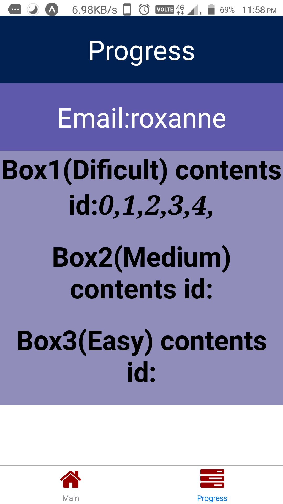

# Leitner-System
#### The App uses Leitner System at it's core to provide fast learning.This app provides German translation of English word
#### This app uses 3 boxes: 1st (Hard) 2nd (Medium) 3rd (Easy).
## UI for user interface:
          

  

# Getting started with the project
#### To get started do a git clone of the repository.Now get inside project folder and run *"npm install"* from cmd to download all dependencies into project.
#### Start the json server on port of your choice after navigating into json server, using [json-server --watch db.json -p 3002] my port here is 3002.After running json-server we have to make data available to our app.For that purpose we will use *"ngrok"*.So make sure to install it .Now run command from another terminal:
#### ngrok http 3002 [make sure the port matches to that of json-server]
#### Now copy the forwarding http link from ngrok and update files under /src/api folder with the new link.
#### That's it now you can start working with the project with live working json-server
# Brownie Feature:
#### User can sign in into existing account with saved progress or sign up with new email.
#### To allow user to save his progress he can press on the "*save progress*" button,which will save user progress into json-server
#### However there is one constraint that [box 1] ie b1 should never be empty before saving.User can monitor his progress on the progress screen,where user can view content of boxes
# Entire LOGIC PART
#### To implement the above problem: I am maintaining three Context state variables *b1,b2,b3* to act as box which will be called when user signs in.
#### Each box stores id of questions .In the beginning all question's id are stored in b1 [box1].
#### Two buttons are provided to check whether user knows the answer or not.
## Handling Correct Response:
#### If user knows the answer he will press button with title "press if you knew it". On pressing it the id of question that he correctly knows will be transferred from *"b1" to "b2"*.
#### The above correct question transfer is achieved through "*function handlecorrect*" which is supplied with id of the current question. Function *handlecorrect* in turn calls function *array_c_manipulation*.
#### The Function *array_c_manipulation* checks contents of *"b2" [box 2]* before contents of *"b1" [box 1]* so as to prevent question from being checked twice.*[Box 3] "b3"* contents are not checked on correct response from user as there is no box beyond it .
## Handling Wrong Response:
#### Handling response when user doesn't know the answer is done in a similar way by function *"handlewrong"* which uses function *"array_w_manipulation"*.
#### The only difference is order of checking boxes which is reverse in function *"array_w_manipulation"* as compared to function *"array_c_manipulation".Contents of *"b2"* checked before *"b3"* 
## Handling Question change and Iteration change
#### This is handled by *"function handleq"* .Now handleq function uses state variables *"g_index"* ,*"iter_v"*,"*qn*" and *"comb"*
### *"qn"* is a state variable that receives id values from "comb" array
### *"g_index"* is a variable used to iterate over values of *"comb"*
### *"comb"* is the array of indices of question's id.This is the array over which we will iterate to get questions "id" which is to finallly present the question to end-user. 
### *"Iter_v"* is the value of iteration.
### How this all works:
#### Now contents of *"b1"* need to be revised on every iteration,while contents of *"b2"* need to be revised on every 2nd iteration and contents of *"b3"* need to be revised on every 3rd iteration.
#### Considering with the above facts "comb" should have contents of "*b1*" and "*b2*" when value of iter_v is divisible by "2",
#### And "comb" should have contents of "*b1*" and "*b3*" when value of iter_v is divisible by "3",
#### And "comb" should have contents of "*b1*","*b2*" and "*b3*" when value of iter_v is divisible by both "2 and 3",
#### And "comb" should have contents of "*b1*" when value of iter_v is otherwise.
#### Thus in this way value of "*comb*" is changed when iter_v changes.
#### And  value "*iter_v*" changes when value of "*g_index*" becomes equal to size of "*comb*" array Or we can say that "*iter_v*" changes when all elements of "*comb*" have been rendered 
#### To finally render the element *"qn"* is provided with contents of *"comb"* array .
#### Using *"qn"* item is rendered by searching question with that id

